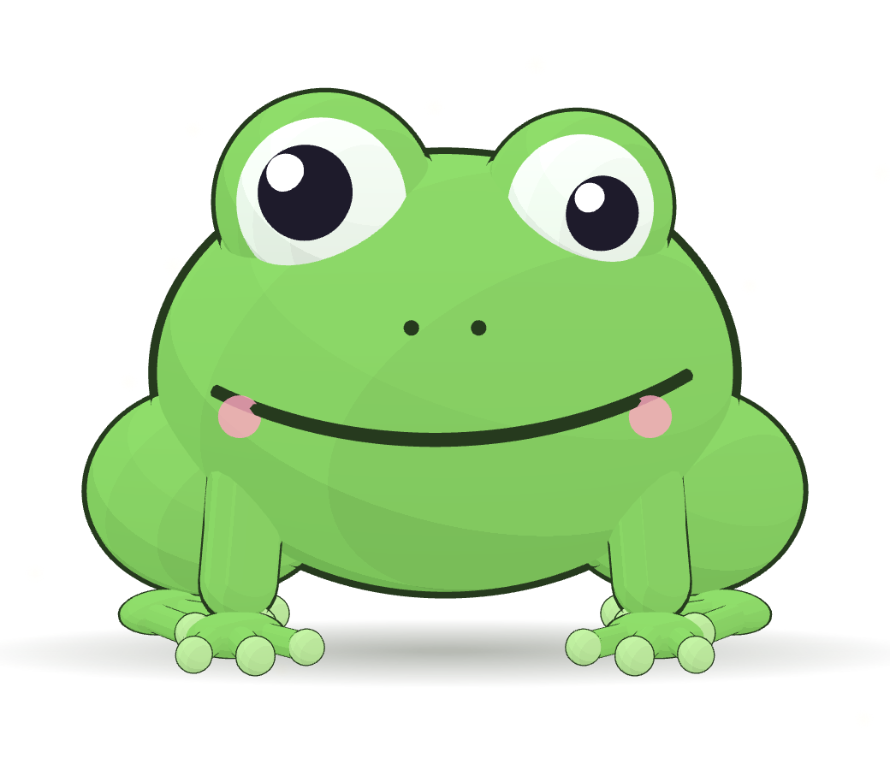

<p align="center"></p>

<h1 align="center">Frog</h1>

<p align="center">An open-source, on-device alternative to Wispr Flow and Granola.<br>It lives on your Mac desktop, and it is a frog.</p>

Hold **fn** and talk. The frog types what you say into whatever is in front of you: a Claude Code or Codex prompt, a terminal, an email. Let go and the text is there. Start it before a call and it takes the notes: who said what, and a summary to read afterwards. Hold **right ⌥ Option** and talk to it. It answers out loud in an old man's voice, remembers what you tell it, and keeps you company while you work. It is fat, lazy, a little sarcastic, and fond of flies.

Everything runs on your Mac. Speech recognition, speaker labels, and the frog's brain are local models, downloaded once. Nothing you say leaves the machine.

## What it does

- **Dictation anywhere.** Hold fn, speak, release. The text lands where your cursor is. Made for coding agents: a long prompt is faster to say than to type.
- **Meeting notes.** Right-click the frog → Notes → Start before a call. It records you and the other side, transcribes both, labels the speakers, and writes a summary.
- **A frog to talk to.** Hold right Option and say something. It talks back, remembers facts ("my sister's name is Anna"), and sets reminders ("remind me at four to call the dentist"), which it says aloud when due. The Mind tab shows what it knows.
- **Words.** Teach it names and jargon. It suggests words it keeps hearing, and correcting a dictation teaches it.
- It wanders around the screen. Switch that off in Me if it bugs you.
- A small frog in the menu bar hides or shows it, opens Notes and settings, and quits.

## The models

All on device, downloaded on first use.

| Job | Model |
|---|---|
| Speech to text | Apple's on-device speech model (SpeechAnalyzer). NVIDIA Parakeet TDT v3 (Core ML, via FluidAudio) is an option in Me. |
| Who said what | FluidAudio speaker diarization (Core ML). |
| The frog's brain | Gemma 4 through llama.cpp, picked by RAM: E4B (5 GB) on 16 GB Macs, 12B (7 GB) on 24 GB, 26B-A4B (17 GB) on 40 GB and up. Qwen2.5 1.5B (1 GB) is the tiny option. |
| Meeting summaries | Apple Intelligence's on-device model. Add a Claude API key in Me and it uses Claude instead; that is the one optional thing that leaves your Mac. |
| Voice | macOS "Grandpa" (AVSpeechSynthesizer). Pick another in Me. |

## Install (no building)

1. Download `Frog.zip` from the latest [release](../../releases), unzip, drag `VoicePet.app` to Applications.
2. First launch: macOS will say it's from an unidentified developer. Open System Settings › Privacy & Security, scroll down, click **Open Anyway**. Once.
3. Grant Microphone, Speech Recognition, and Accessibility when asked (Accessibility is for the fn key and for typing into other apps).
4. System Settings › Keyboard › "Press 🌐 key to" → **Do Nothing**, or fn also opens the emoji picker.

Needs macOS 26 on Apple Silicon. On first launch it downloads its brain in the background. Dictation works immediately; the frog starts talking once the download is done.

## Build from source

```bash
git clone https://github.com/Pyanov/frog.git && cd frog
(cd web && npm install)
./build.sh && cp -R build/VoicePet.app ~/Applications/ && open ~/Applications/VoicePet.app
```

Xcode Command Line Tools and Node 18+ are enough; no Xcode. The first build compiles llama.cpp and takes a few minutes.

## Make it your own creature

The frog is one three.js file, `web/src/main.js`. Open the repo in Claude Code and ask for a different animal; `CLAUDE.md` explains the small contract the app expects (`pet.setState`, `pet.setLevel`, `pet.lookAt`, plus optional `setVelocity`, `setTalking`). Personas for the brain live in `Sources/VoicePet/Brain.swift`.

## Under the hood

Swift/AppKit app built with SwiftPM. Apple SpeechAnalyzer or Parakeet v3 for speech, FluidAudio for diarization, llama.cpp via LLM.swift for the brain (Gemma 4 GGUFs from Unsloth), Apple Foundation Models for summaries, AVSpeechSynthesizer for the voice, a WKWebView with three.js for the frog. Notes, vocabulary, memory, and models live in `~/Library/Application Support/VoicePet/`.

## License

MIT.
