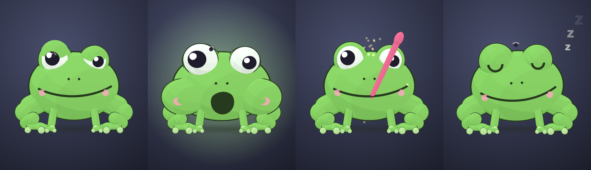

# Frog

A fat, lazy frog that lives on your Mac desktop and types what you say. Hold **fn**, talk, let go. It also takes meeting notes, remembers things, and talks back in an old man's voice. Everything runs on your Mac. Nothing leaves it.



## Install (no building)

1. Download `Frog.zip` from the latest [release](../../releases), unzip, drag `VoicePet.app` to Applications.
2. First launch: macOS will say it's from an unidentified developer. Open System Settings › Privacy & Security, scroll down, click **Open Anyway**. Once.
3. Grant Microphone, Speech Recognition, and Accessibility when asked (Accessibility is for the fn key and for typing into other apps).
4. System Settings › Keyboard › "Press 🌐 key to" → **Do Nothing**, or fn also opens the emoji picker.

Needs macOS 26 on Apple Silicon. On first launch it downloads its brain (a local language model) in the background: about 5 GB on a 16 GB Mac, 7 GB on 24 GB, 17 GB on 40 GB or more. Dictation works immediately; the frog starts talking once the download is done.

## What it does

- **Dictation.** Hold fn anywhere, speak, release. Text lands where your cursor is. Apple's on-device speech model by default; NVIDIA Parakeet as an option in the Me tab.
- **Meeting notes.** Right-click the frog → Notes → Start before a call. It records you and the call, transcribes both, labels speakers (FluidAudio diarization), and writes a summary with a local Gemma 4 model.
- **Talk to it.** Hold **right ⌥ Option** and speak. It answers out loud (macOS "Grandpa" voice, pick another in Me). It remembers facts you tell it and sets reminders ("remind me at four to call the dentist"), which it says aloud when due. See the Mind tab.
- **Words.** Teach it names; it suggests words it keeps hearing; fixing a dictation teaches it a correction.
- It wanders around the screen. Switch that off in Me if it bugs you.

## Build from source

```bash
git clone <this repo> && cd frog
(cd web && npm install)
./build.sh && cp -R build/VoicePet.app ~/Applications/ && open ~/Applications/VoicePet.app
```

Xcode Command Line Tools and Node 18+ are enough; no Xcode. The first build compiles llama.cpp and takes a few minutes.

## Make it your own creature

The frog is one three.js file, `web/src/main.js`. Open the repo in Claude Code and ask for a different animal; `CLAUDE.md` explains the small contract the app expects (`pet.setState`, `pet.setLevel`, `pet.lookAt`, plus optional `setVelocity`, `setTalking`). Personas for the on-device brain live in `Sources/VoicePet/Brain.swift`.

## Under the hood

Swift/AppKit app built with SwiftPM. Apple SpeechAnalyzer or Parakeet v3 (Core ML) for speech, FluidAudio for diarization, llama.cpp via LLM.swift for the brain (Gemma 4 GGUFs from Unsloth), AVSpeechSynthesizer for the voice, a WKWebView with three.js for the frog. Notes, vocabulary, memory, and models live in `~/Library/Application Support/VoicePet/`.
